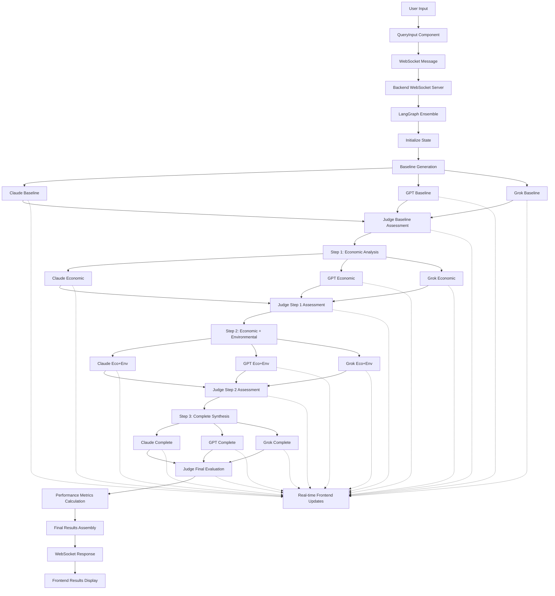

# 🚀 Multi-Perspective LLM Ensemble System - Query Flow Documentation

## 📋 Table of Contents
1. [System Overview](#system-overview)
2. [Detailed Query Flow](#detailed-query-flow)
3. [Component Architecture](#component-architecture)
4. [Data Flow Diagram](#data-flow-diagram)
5. [API Messages & WebSocket Communication](#api-messages--websocket-communication)
6. [Performance Metrics Calculation](#performance-metrics-calculation)

---

## 🎯 System Overview

The Multi-Perspective LLM Ensemble System processes user queries through a sophisticated pipeline that combines multiple AI models (Claude, GPT, Grok) with judge oversight to provide comprehensive, multi-perspective analysis.

### Core Architecture:
- **Frontend**: React TypeScript application with real-time WebSocket updates
- **Backend**: Python WebSocket server with LangGraph orchestration
- **LLMs**: Claude, GPT, and Grok models for diverse perspectives
- **Judge System**: Oversight and quality assessment at every stage
- **Memory System**: Comprehensive logging and result storage

---

## 🔄 Detailed Query Flow

### Phase 1: Frontend Input & Initialization
```
[User Input] → [QueryInput Component] → [WebSocket Message] → [Backend Server]
```

#### 1.1 User Input Processing
- **Location**: `fontend/src/components/QueryInput.tsx`
- **User provides**:
  - Main query text
  - Universal Chain of Thought guidance (optional)
  - Perspective-specific CoT guidance (optional)
- **Data structure**:
  ```typescript
  {
    query: string,
    universalCot: string,
    perspectiveCots: {
      economic: string,
      environmental: string,
      technological: string
    }
  }
  ```

#### 1.2 WebSocket Connection
- **Location**: `fontend/src/hooks/useWebSocket.ts`
- **Message sent**:
  ```json
  {
    "type": "start_analysis",
    "query": "user query here",
    "universal_cot": "guidance",
    "perspective_cots": {...}
  }
  ```

### Phase 2: Backend Processing Initialization
```
[WebSocket Server] → [LangGraph Ensemble] → [State Initialization]
```

#### 2.1 WebSocket Server Reception
- **Location**: `backend_websocket_server.py:websocket_handler()`
- **Process**:
  1. Receives WebSocket message
  2. Validates query data
  3. Initializes LangGraph ensemble
  4. Starts async processing

#### 2.2 LangGraph State Initialization
- **Location**: `graph/multi_perspective_ensemble_graph.py:run_ensemble()`
- **Initial State Creation**:
  ```python
  initial_state = MultiPerspectiveEnsembleState(
    query=query,
    universal_cot=universal_cot,
    perspective_cots=perspective_cots,
    agents={
      "claude": AgentState(),
      "gpt": AgentState(), 
      "grok": AgentState()
    }
  )
  ```

### Phase 3: Baseline Analysis Generation
```
[Parallel Baseline Generation] → [Judge Assessment] → [State Update]
```

#### 3.1 Baseline Response Generation (Parallel)
- **Location**: `graph/multi_perspective_nodes.py:baseline_generation_node()`
- **Process for each agent**:
  1. Create baseline prompt (no multi-perspective guidance)
  2. Call respective LLM API (Claude/GPT/Grok)
  3. Store baseline response
  4. Send real-time update to frontend

- **WebSocket Messages Sent**:
  ```json
  {
    "type": "agent_update",
    "agent": "claude|gpt|grok",
    "status": "thinking|processing|completed",
    "output": "baseline response",
    "confidence": 0.5
  }
  ```

#### 3.2 Baseline Judge Assessment
- **Location**: `graph/multi_perspective_nodes.py:judge_baseline_node()`
- **Judge evaluates**:
  - Quality of individual baseline responses
  - Identifies gaps and improvement opportunities
  - Sets foundation for multi-perspective enhancement

### Phase 4: Multi-Perspective Analysis (3-Step Process)
```
[Step 1: Economic] → [Judge] → [Step 2: Economic+Environmental] → [Judge] → [Step 3: Complete Synthesis] → [Judge]
```

#### 4.1 Step 1: Economic Perspective
- **Location**: `graph/multi_perspective_nodes.py:step1_economic_node()`
- **Process**:
  1. Enhanced prompt with economic focus + CoT guidance
  2. Each agent analyzes from economic perspective
  3. Judge assessment of economic analysis quality
  4. Real-time updates to frontend

- **Prompt Enhancement**:
  ```python
  economic_prompt = create_perspective_prompt(
    query=query,
    perspective="economic",
    universal_cot=universal_cot,
    specific_cot=perspective_cots.get("economic", "")
  )
  ```

#### 4.2 Step 2: Economic + Environmental Integration
- **Location**: `graph/multi_perspective_nodes.py:step2_economic_environmental_node()`
- **Process**:
  1. Builds upon Step 1 economic analysis
  2. Integrates environmental considerations
  3. Judge assessment of integration quality
  4. Progressive analysis depth increase

#### 4.3 Step 3: Complete Multi-Perspective Synthesis
- **Location**: `graph/multi_perspective_nodes.py:step3_complete_synthesis_node()`
- **Process**:
  1. Integrates economic + environmental + technological perspectives
  2. Creates comprehensive synthesis
  3. Final confidence scoring
  4. Judge assessment of complete analysis

### Phase 5: Judge Comprehensive Evaluation
```
[Final Judge Analysis] → [Comparative Assessment] → [Best Synthesis Selection]
```

#### 5.1 Judge Final Evaluation
- **Location**: `graph/multi_perspective_nodes.py:judge_final_node()`
- **Judge Process**:
  1. Compares all agent syntheses
  2. Evaluates methodology effectiveness
  3. Selects best insights from each agent
  4. Creates final comprehensive synthesis
  5. Methodology assessment and recommendations

### Phase 6: Performance Analysis & Logging
```
[Performance Metrics] → [Baseline Comparison] → [Quality Scoring] → [Memory Storage]
```

#### 6.1 Performance Metrics Calculation
- **Location**: `graph/multi_perspective_nodes.py:performance_logging_node()`
- **Metrics Generated**:
  ```python
  improvement_metrics = {
    "claude_length_improvement": float,
    "gpt_length_improvement": float,
    "grok_length_improvement": float,
    "confidence_improvement": float,
    "average_final_confidence": float,
    "average_baseline_confidence": float,
    "average_length_improvement": float
  }
  
  baseline_comparison = {
    "claude_baseline_vs_ensemble": {
      "baseline_length": int,
      "ensemble_length": int, 
      "length_ratio": float
    },
    # Similar for GPT and Grok
  }
  ```

#### 6.2 Final Results Assembly
- **Location**: `graph/multi_perspective_ensemble_graph.py:run_ensemble()`
- **Results Structure**:
  ```python
  final_results = {
    "judge_evaluation": {
      "final_synthesis": str,
      "comparative_analysis": str,
      "reasoning": str,
      "confidence": float
    },
    "performance_comparison": {
      "baseline_comparison": dict,
      "improvement_metrics": dict,
      "multi_perspective_advantage": dict
    },
    "baseline_responses": dict,
    "multi_perspective_analyses": dict,
    "stage_assessments": list,
    "processing_time": float
  }
  ```

### Phase 7: Frontend Results Display
```
[WebSocket Results] → [Results Component] → [Formatted Display] → [User Interface]
```

#### 7.1 Results Reception & Processing
- **Location**: `fontend/src/App.tsx:handleWebSocketMessage()`
- **Message Type**: `"analysis_complete"`
- **State Updates**:
  ```typescript
  setAnalysisState(prev => ({
    ...prev,
    status: 'completed',
    results: data.results,
    processingTime: data.processing_time,
    baselineResponses: data.results?.baseline_responses || {},
    multiPerspectiveAnalyses: data.results?.multi_perspective_analyses || {},
    stageAssessments: data.results?.stage_assessments || []
  }));
  ```

#### 7.2 Results Display & Formatting
- **Location**: `fontend/src/components/Results.tsx`
- **Display Components**:
  1. **Judge Comprehensive Evaluation** with formatted synthesis
  2. **Baseline vs Enhanced Comparison** for each agent
  3. **Enhanced Performance Comparison** with dynamic metrics
  4. **Enhancement Summary** with real-time counts

---

## 🏗️ Component Architecture

### Backend Components
```
┌─────────────────────────────────────────────────────────────┐
│                    WebSocket Server                         │
│                (backend_websocket_server.py)               │
└─────────────────────┬───────────────────────────────────────┘
                      │
┌─────────────────────▼───────────────────────────────────────┐
│              LangGraph Ensemble                             │
│         (multi_perspective_ensemble_graph.py)              │
└─────────────────────┬───────────────────────────────────────┘
                      │
┌─────────────────────▼───────────────────────────────────────┐
│              Multi-Perspective Nodes                       │
│            (multi_perspective_nodes.py)                    │
│  ┌───────────────┬──────────────┬─────────────────────────┐ │
│  │   Baseline    │ Multi-Step   │    Judge & Performance  │ │
│  │  Generation   │  Analysis    │      Assessment        │ │
│  └───────────────┴──────────────┴─────────────────────────┘ │
└─────────────────────────────────────────────────────────────┘
```

### Frontend Components
```
┌─────────────────────────────────────────────────────────────┐
│                      App.tsx                               │
│                  (Main Coordinator)                        │
└─────────────────────┬───────────────────────────────────────┘
                      │
        ┌─────────────┼─────────────┐
        │             │             │
┌───────▼──────┐ ┌────▼────┐ ┌──────▼────────┐
│ QueryInput   │ │Progress │ │ AgentGrid     │
│              │ │Tracker  │ │               │
└──────────────┘ └─────────┘ └───────────────┘
        │             │             │
        └─────────────┼─────────────┘
                      │
        ┌─────────────┼─────────────┐
        │             │             │
┌───────▼──────┐ ┌────▼────────────▼──────────┐
│LiveResponse │ │        Results             │
│Feed         │ │  (Comprehensive Display)   │
└─────────────┘ └────────────────────────────┘
```

---

## 📊 Data Flow Diagram



---

## 🔄 API Messages & WebSocket Communication

### Frontend → Backend Messages

#### 1. Start Analysis
```json
{
  "type": "start_analysis",
  "query": "How should governments regulate cryptocurrency?",
  "universal_cot": "Be comprehensive and evidence-based",
  "perspective_cots": {
    "economic": "Focus on market impacts and costs",
    "environmental": "Consider sustainability and energy usage",
    "technological": "Evaluate technical feasibility"
  }
}
```

### Backend → Frontend Messages

#### 1. Agent Updates (Real-time)
```json
{
  "type": "agent_update",
  "agent": "claude",
  "status": "processing",
  "perspective": "economic",
  "output": "Economic analysis in progress...",
  "confidence": 0.75,
  "cotGuidance": "Applied economic-focused CoT",
  "step": 1
}
```

#### 2. Judge Assessments
```json
{
  "type": "judge_assessment", 
  "stage": "step1_economic",
  "assessment": "Economic analysis shows good depth...",
  "confidence": 0.85,
  "timestamp": "2025-09-12T17:00:00Z"
}
```

#### 3. Step Completion
```json
{
  "type": "step_complete",
  "step": 2,
  "description": "Economic and environmental integration complete"
}
```

#### 4. Multi-Perspective Updates
```json
{
  "type": "multi_perspective_update",
  "agent": "gpt",
  "step1_economic": "Economic perspective content...",
  "step2_economic_environmental": "Integrated analysis...",
  "step3_complete_synthesis": "Final synthesis...",
  "final_confidence": 0.88,
  "reasoning_evolution": ["step1", "step2", "step3"]
}
```

#### 5. Final Results
```json
{
  "type": "analysis_complete",
  "results": {
    "judge_evaluation": {
      "final_synthesis": "Comprehensive regulatory framework...",
      "comparative_analysis": "Comparison of agent approaches...",
      "reasoning": "Judge reasoning process...",
      "confidence": 0.92
    },
    "performance_comparison": {
      "baseline_comparison": {
        "claude_baseline_vs_ensemble": {
          "baseline_length": 1500,
          "ensemble_length": 4200,
          "length_ratio": 2.8
        }
      },
      "improvement_metrics": {
        "average_length_improvement": 2.5,
        "confidence_improvement": 0.15,
        "average_final_confidence": 0.85
      }
    },
    "baseline_responses": {...},
    "multi_perspective_analyses": {...},
    "stage_assessments": [...]
  },
  "processing_time": 45.67
}
```

---

## 📈 Performance Metrics Calculation

### Improvement Metrics
```python
# Length-based comprehensiveness
length_improvement = len(ensemble_synthesis) / max(len(baseline_content), 1)

# Confidence improvements  
confidence_improvement = avg_final_confidence - avg_baseline_confidence

# Quality scores
quality_scores = {
  "consensus_confidence": 0.92,
  "total_tokens": 8965,
  "agents_consulted": 3,
  "baseline_comparisons": 3,
  "overall_quality": 0.88,
  "coherence": 0.91,
  "completeness": 0.85,
  "depth": 0.89
}
```

### Multi-Perspective Advantage Calculation
```python
def _calculate_advantage_metrics(self, final_state):
  return {
    "comprehensiveness_improvement": avg_synthesis_length / avg_baseline_length,
    "perspective_coverage": 3.0,  # Economic, Environmental, Technological
    "methodology_effectiveness": judge_confidence,
    "consensus_strength": min(agent_confidences) / max(agent_confidences)
  }
```

---

## 🎯 Key Features & Benefits

### 1. **Real-Time Progress Tracking**
- Live updates for each agent and processing step
- WebSocket communication for instant feedback
- Progress tracker with stage-by-stage visualization

### 2. **Comprehensive Quality Assessment**
- Judge oversight at every stage
- Baseline vs enhanced comparison
- Performance metrics and improvement tracking

### 3. **Multi-Perspective Analysis**
- Economic, environmental, and technological viewpoints
- Progressive integration across perspectives
- Chain of Thought guidance for enhanced reasoning

### 4. **Dynamic Results Display**
- Formatted text with proper structure
- Expandable content for detailed analysis
- Interactive performance metrics visualization

### 5. **Memory & Logging System**
- Comprehensive result storage
- Performance tracking over time
- Methodology effectiveness analysis

---

## 🔧 Technical Implementation Details

### State Management
- **Backend**: LangGraph state management with `MultiPerspectiveEnsembleState`
- **Frontend**: React state with real-time WebSocket updates
- **Persistence**: Memory logger for comprehensive result storage

### API Integration
- **Claude**: Anthropic API with enhanced prompting
- **GPT**: OpenAI API with Chain of Thought guidance
- **Grok**: X.AI API for diverse perspective coverage

### Error Handling & Resilience
- WebSocket reconnection logic
- Graceful degradation for API failures
- Comprehensive error logging and reporting

---

This documentation provides a complete overview of how queries flow through the Multi-Perspective LLM Ensemble System, from user input to final results display, including all intermediate processing steps, real-time communication, and performance analysis.
